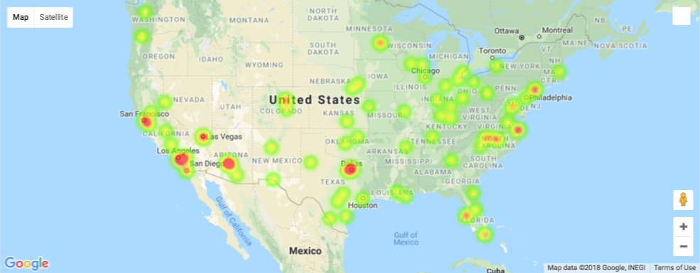

# Airport-Analysis

# Background
Using Google APIs  

# Goals
Make a heat map that shows which airports have better rates. 
Uncover a possible relationship between Busy Airports and Airports ratings.

# Findings

